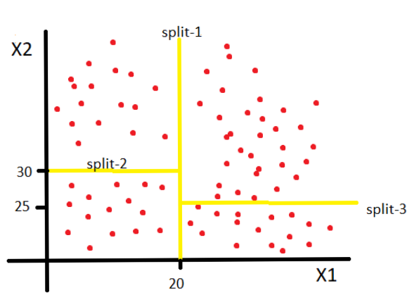

# Decision Tree Regression

For understanding the algorithm we will consider a example of 2 independent variables and one dependent variable.

Let the two independent variables be X1 and X2. Now in the training set we have some data points with their values of dependent variable. For understanding this better, we plot the data points on a 2d plane with one axis as X1 and another as X2.

 

In the above diagram the red points are the data points. The algorithm makes lines(splits) as shown above in yellow, these splits divide the data points into smaller regions. The splits are made on the basis of information entropy(which measures whether the information increase after the split). So after these splits the dependent variable values of each smaller regions is averaged and stored in the model. Now when we want to predict the dependent variable for a particular region , we simply see in which region does the point lie and assigns the corresponding value of the dependent variable to the point. 

<b>Note:</b> In the above figure I have made only 3 splits, but the algorithm will make many splits to get better prediction. This concept remains same for any dimensions , just the splits will be points , planes, etc. instead of lines.