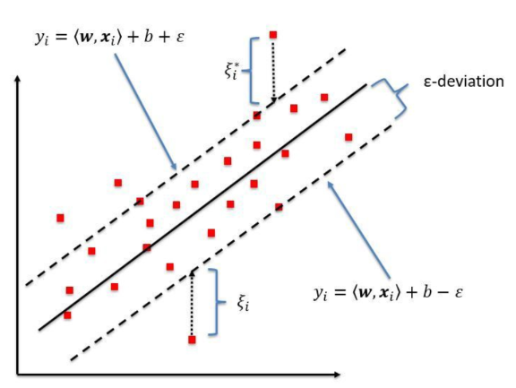

## Support Vector Regression(SVR) and Support Vector Machines(SVM)

In SVM we divide the dataset into classes using different methods. In SVR we find the model that fits the data optimally.

For understanding this topics we should first know some terminologies:

<b>Kernel:</b> This is a function that maps the independent variables to the dependent variables. We can use different kernels, they could be linear or non linear. Some of the common kernels are:

* Polynomial Kernel
* Gaussian Kernel
* Gaussian Radial-Basis Function(RBF)
* Linear Kernel
* Laplace RBF Kernel
* Hyperbolic Tangent Kernel
* Sigmoid Kernel

<b>Hyper Plane:</b> In SVM this is the plane(or line) that separates the classes. In SVR this is the line that fits the data according to the given kernel and helps us predict the output vale.

<b>Boundary Line:</b> In SVR the model tries to fit as many data points as possible within the boundary lines. These boundary lines are beside the hyper plane at a distance of  ±ϵ from the hyper plane. In SVM these lines create a margin.

<b>Support Vectors:</b> These are the data points that are closest to the boundary.

## Example

The dotted lines in the above figure are the boundary lines. And the solid black line is the hyper plane. This is an example of **Linear Kernel** , that's why we have a linear hyper plane. We can use different kernels according to our data points , that will result in corresponding hyper planes . The concept in SVM and SVR is very similar just in the case of SVR we train the model for predicting continuous values for input (independent variables) and in the case of SVM we classify the data points into classes with the help of the hyper plane.

