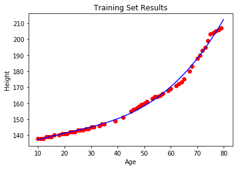
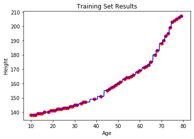
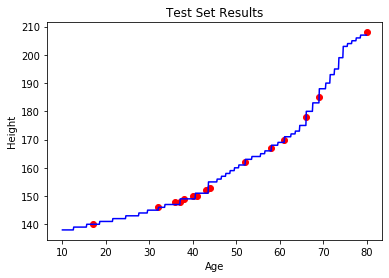

# Machine-Learning-Using-Python
This repository contains codes for machine learning algorithms with examples which are presented visually using graphs 

# Table Of Contents 
  * [Libraries Used](#libraries-used)
  * [Usage](#usage)
  * [Regression](#regression)
    * [Simple Linear Regression](#simple-linear-regression)
    * [Multiple Linear Regression](#multiple-linear-regression)
    * [Polynomial Regression](#polynomial-regression)
    * [Support Vector Regression(SVR)](#support-vector-regression)
    * [Decision Tree Regression](#decision-tree-regression)
    * [Random Forest Regression](#random-forest-regression)
  * [Classification](#classification)
  * [License](#license)
    
# Libraries Used
1) matplotlib(version 3.1.3)
2) numpy(version 1.18.1)
3) pandas(version 1.0.1)
4) sklearn(version 0.22.1)

# Usage

Install the required libraries and then run the code using any IDE(I have used spyder).

**Note:** Don't forget to set the working directory to the folder that contains the python code as the datasets are imported using relative paths.

# Regression
In regression, we train different models to predict the dependent variable according to the independent variables.For achieving this goal, we divide our dataset into two sets, a training set and a test set.We will train the model using the training set and then see how good is the model on the basis of test set.

**Note:** in these examples,we will visualise the test set and training set results rather than judging them mathmatically.

## Simple Linear Regression

Code for simple linear regression is in the file "linear_regression.py".In simple linear regression we make a linear model.Therefore, the equation for the model is:
**y=b0+b1x** here x = independent variable,y = dependent variable,b0&b1 are constants obtained by training the model.
 Here we will be using the "Admission_Predict.csv" dataset.Which contains performance of students in various exams and the chances of the student getting selected in the college(0 being 0% chance and 1 being 100% chance).As this is a example of simple linear regression,we will take only one independent variable(GRE marks) and one dependent variable(chance of getting selected).
  &nbsp; &nbsp; &nbsp;

<a>

 In the above images, the blue line is the model that we trained and the red dots are the data points obtained from the dataset.
</a> 

## Multiple Linear Regression

Code for multiple linear regression is in the file "multiple_linear_regression.py".In multiple linear regression the equation for the model is:
**y=b0+b1x1+b2x2........+bnxn** here xi = independent variables,y = dependent variable,bi are constants obtained by training the model...where 'i' is a positive integer
 Here we will be using the "Admission_Predict.csv" dataset.Which contains performance of students in various exams and the chances of the student getting selected in the college(0 being 0% chance and 1 being 100% chance).As this is a example of simple linear regression,we will take only two independent variables(GRE score & TOFEL score)and one dependent variable(chance of getting selected).
  &nbsp; &nbsp; &nbsp;

<a>
 
 In the above images, the black line is the model that we trained and the colourful dots are the data points obtained from the dataset.
  **Note:** The colour and transparency of the dots doesn't signify anything,it is just used to get a proper 3D view.We can also train the model with more than two variables,but we will not be able to visualise it on graphs.
</a> 

## Polynomial Regression

Code for polynomial regression is in the file "polynomianl_regression.py".In polynomial regression the equation for the model is:
**y=b0+b1x1+b2x2........+bnxn** here n = degree of the polynomial,x = independent variable,y = dependent variable,bi are constants obtained by training the model...where 'i' is a positive integer.
 Here we will be using "HeightVsAge.csv" dataset which contains the average height(dependent variable) at different ages. 
  &nbsp; &nbsp; &nbsp;

<a>

 In the above images, the blue curve is the model that we trained and the red dots are the data points obtained from the dataset.
 **Note:** The model in above images is trained using a polynomial of degree 3,you can change the degree and find the optimal fit for a given data.
</a> 

## Support Vector Regression

Code for support vector regression(svr) is in the file "support_vector_regression.py". 
 Here we will be using "HeightVsAge.csv" dataset which contains the average height(dependent variable) at different ages.In support vector regression , we can use different kernels to train the model according to the distribution of the data points.In this case , we have used the 'Gaussian RBF Kernel'. For learning more about kernels and other terminologies click [<u>here</u>](/Explanations/svm_svr.md)

  &nbsp; &nbsp; &nbsp;

<a>

 In the above images, the blue curve is the model that we trained and the red dots are the data points obtained from the dataset.
 
 ## Decision Tree Regression
 Code for decision tree regression is in the file "decision_tree_regression.py".
  Here we will be using "HeightVsAge.csv" dataset which contains the average height(dependent variable) at different ages. In decision tree regression , we make splits in the data points to make them into smaller groups and then predict the dependent variable value of the new data point on the basis of theese groups. For learning more about these splits click [<u>here</u>](/Explanations/decision_tree_regression.md) . In one dimension these slits looks like steps when plotted on graph with the dependent variable.
 
   &nbsp; &nbsp; &nbsp;

<a>
 
In the above images, the blue steps are the model that we trained and the red dots are the data points obtained from the dataset.
 
 ## Random Forest Regression
  Code for random forest regression is in the file "random_forest_regression.py".
   Here we will be using "HeightVsAge.csv" dataset which contains the average height(dependent variable) at different ages. In random forest regression, we basically use multiple decision trees. We select some random points from the dataset and train the decision tree with those points, we do this for each decision tree. We we need to predict the dependent variable for a datapoint, we take the predicted value from each decision tree and then average it.
    &nbsp; &nbsp; &nbsp;

<a> 
 
 In the above images, the blue steps are the model that we trained and the red dots are the data points obtained from the dataset.Here we have more steps than the decision tree regression.
 
# Classification
In classification, we classify the new datapoints in predefined catagories.For this purpose, we train a model with a dataset.The model tries to find the characteristics that correspond to that particular category.
 For eg: if we want to see whether a person will buy a product or not.Let the independent variables are income and age and the dependent variable be whether the person will buy the product.Thus, the model will try to find the age range and income range of the people who buy the product.
 We will see how good the model is with the help of confusion matrix.This is a 2x2 matrix, for eg.[[30,5],[7,40]].The number of correct predictions by the model are:30+40=70.The number of incorrect predictions are:5+7=12.

## Logistic Regression
 Code for logistic regression is in the file "logistic_regression.py".

# License
Licensed under the [MIT License](LICENSE).
